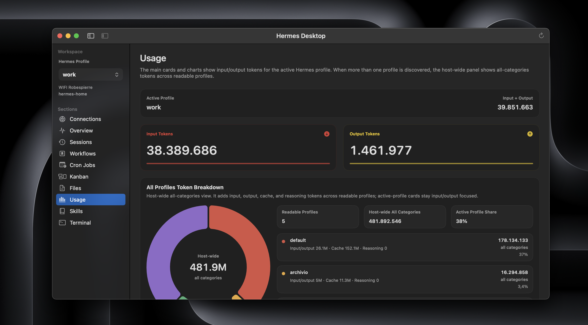

# Hermes Desktop

Native macOS companion for Hermes Agent over SSH.

It turns the daily Hermes loop into something you can actually live in on a
Mac.

It brings the parts of the workflow that matter most into one focused window:
sessions, Kanban, workspace files, usage, skills, cron jobs, and a real
terminal.

If Hermes is already part of how you work, the app should feel immediately
legible: same host, same files, same profiles.

No browser wrapper. No gateway API. No daemon on the host. No local mirror. No
extra sync layer slowly drifting away from the machine that actually matters.

That restraint is intentional:

- connects directly over SSH
- keeps the Hermes host as the only source of truth
- does not depend on a gateway API
- does not mirror files onto your Mac
- does not install a helper service on the remote host

That is the point of the app.

Hermes Desktop does not invent a softer second version of Hermes. It makes the
real workflow feel calm, fast, and native on a Mac while keeping the model
visible. You still know what host you are on, which Hermes profile is active,
where the canonical state lives, and which path the app is actually using.

## Preview

<table>
  <tr>
    <td width="50%">
      
    </td>
    <td width="50%">
      
    </td>
  </tr>
  <tr>
    <td width="50%">
      
    </td>
    <td width="50%">
      
    </td>
  </tr>
  <tr>
    <td width="50%">
      
    </td>
    <td width="50%">
      
    </td>
  </tr>
</table>

Six views from a live Hermes host: sessions, Kanban, workspace files, usage,
skills, and terminal workflows.

## What You Get

- a native macOS workspace for the Hermes host you already use over SSH
- profile-aware connection handling for the default Hermes home and named
  Hermes profiles on the same host
- the real remote state in one place: sessions, Kanban, workspace files, usage,
  skills, cron jobs, and terminal work
- a session workbench for searching session metadata and message content,
  reading transcripts, pinning important sessions, continuing a chat, and
  resuming the same session in Terminal
- a native Kanban workspace for the upstream host-wide Kanban home: the default
  `~/.hermes/kanban.db` board plus additional upstream boards when the host
  supports them
- direct editing for canonical Hermes files, selected remote text files, and
  remote `SKILL.md` files, with conflict checks before save
- an embedded SSH terminal with tabs, themes, and enough room for real
  multi-agent work across hosts and profiles
- a universal Mac release for Apple Silicon and Intel, with English,
  Simplified Chinese, and Russian localization resources in the app bundle

If Hermes runs there and SSH already works, Hermes Desktop will usually meet you
there. That includes:

- Raspberry Pi
- another Mac
- a VPS or remote server
- the same Mac via `ssh localhost`, a local hostname, or a local SSH alias

## Hermes Desktop And The Official Web Dashboard

Nous Research now ships the official Hermes web dashboard. That is good news.

The dashboard is the browser-based management surface for Hermes: configuration,
API keys, logs, sessions, analytics, cron jobs, skills, and browser chat. It is
the right place when you want a local web UI around the installation.

Hermes Desktop is deliberately different. It is a native Mac workspace for
people who want to stay close to the host itself: direct SSH, profile-aware
remote files, sessions, Kanban, cron jobs, editable skills, usage, and a real
terminal in one focused app.

The boundary is simple: browser for administration, Mac app for host work.
Hermes Desktop stays valuable because it does not create another backend around
Hermes. It gives the existing SSH path a native surface.

## Before You Download

Setup is intentionally lightweight. You need only a few things:

- a Mac running macOS 14 or newer
- SSH access from this Mac that already works in Terminal without interactive
  prompts
- the SSH host key already accepted once in Terminal for that target
- a normal route from this Mac to the Hermes host, such as local LAN, public
  IP or DNS, VPN, or a Tailscale IP or hostname
- `python3` available on the Hermes host
- `hermes` available on the host's non-interactive SSH `PATH` for in-app chat
  turns and terminal resume workflows
- a Hermes Agent build with upstream Kanban support if you want the native
  Kanban workspace; multiple-board management appears when the host exposes the
  newer upstream board APIs
- Hermes data under the remote user's `~/.hermes`

Simple rule: if this works in Terminal from this Mac without asking for a
password or host key confirmation, the app is usually ready to work too:

```bash
ssh your-host
```

## Install

Install takes about a minute:

1. Download `HermesDesktop.app.zip` from the
   [latest GitHub Release](https://github.com/dodo-reach/hermes-desktop/releases/latest).
2. Double click the zip to extract `HermesDesktop.app`.
3. Quit Hermes Desktop if an older version is already running.
4. Drag `HermesDesktop.app` into `Applications` and replace the old copy if
   macOS asks.
5. First launch: right click `HermesDesktop.app`, choose `Open`, then confirm
   `Open`.

Hermes Desktop is currently distributed as a universal macOS build for Apple
Silicon and Intel Macs. The app is ad-hoc signed and not notarized by Apple, so
macOS may show a warning saying Apple cannot verify it for malware. That is
expected for this distribution model and does not mean macOS found malware in
Hermes Desktop.

If macOS blocks the first launch:

1. Click `Done`, not `Move to Bin`.
2. Right click `HermesDesktop.app` and choose `Open`.
3. If needed, go to `System Settings` > `Privacy & Security` and click
   `Open Anyway`.

Do not disable Gatekeeper or run `sudo` commands to install Hermes Desktop.

## Verify The Download

Each GitHub Release includes a SHA-256 checksum for `HermesDesktop.app.zip`.
Compare it with the value printed locally after downloading:

```bash
shasum -a 256 HermesDesktop.app.zip
```

After installing:

```bash
codesign --verify --deep --strict /Applications/HermesDesktop.app
```

## Connect Your Hermes Host

Open the app, go to `Connections`, create a profile, then click `Test` and
`Use Host`.

You have two valid ways to fill the connection. In most cases, an SSH alias is
the cleanest one:

### Option 1: SSH alias

An SSH alias is just a short name saved in your Mac's SSH config, so instead of
typing a long command every time, you can type something simple like:

```bash
ssh hermes-home
```

That short name usually comes from `~/.ssh/config`.

Example:

```sshconfig
Host hermes-home
  HostName vps.example.com
  User alex
```

In the app:

- set `SSH alias` to `hermes-home`
- leave `Host`, `User`, and `Port` empty unless you want explicit overrides

### Option 2: host details directly

If you normally connect with something like:

```bash
ssh alex@vps.example.com
```

then in the app:

- `Host or IP`: `vps.example.com`
- `User`: `alex`
- `Port`: `22` or your real SSH port

### Hermes profiles on the same host

Hermes Desktop can target either the default Hermes home or a named profile on
the same SSH host.

Examples:

- leave `Hermes profile` empty to use `~/.hermes`
- set `Hermes profile` to `researcher` to use
  `~/.hermes/profiles/researcher`

The important part is what happens after that: the profile selection is not a
label stuck on a form. It flows through the app.

Overview resolves against that profile. Usage stays scoped to that profile while
still being able to show host-wide cross-profile totals. Cron jobs target that
profile's scheduler state. The terminal launches with the right `HERMES_HOME`.
And terminal tabs can stay open across different profiles, so it is natural to
work multiple Hermes agents on the same host side by side.

### Same Mac

If Hermes runs on the same Mac, the model stays the same: SSH.

Use one of these:

- `localhost`
- your local hostname
- a local SSH alias

Hermes Desktop still connects over SSH and never reads those files directly.

## What `Test` Checks

`Test` is the preflight, not a cosmetic button.

It checks that:

- the SSH target is reachable
- authentication works without interactive prompts
- `python3` is available in the remote SSH environment used by the app

If `Test` passes, `Use Host` should be on solid ground.

Feature-specific requirements, such as the remote `hermes` CLI path and Kanban
support, are checked when those sections actually run.

## Ways To Chat With Hermes

Hermes Desktop does not replace the terminal surfaces Hermes already gives you.
It lets you choose the right one for the job:

- use in-app chat in `Sessions` for quick turns, checking context, or
  continuing a session while you are already in Hermes Desktop
- use the embedded `Terminal` for heavier work where you want the shell,
  command approvals, long-running output, or manual control close at hand; from
  there you can run `hermes`, `hermes chat`, or a one-shot prompt such as
  `hermes chat -q "Hello"`
- use `hermes --tui` in the terminal when you want Hermes Agent's modern TUI
  for longer interactive sessions, richer overlays, session picking, and the
  same sessions, slash commands, and config as the classic CLI

All of these paths still run Hermes on the selected host. The choice is about
surface area and workflow, not about creating a second source of truth.

## What You Will See In The App

- `Overview`
  Confirms the active host, the active Hermes profile, the discovered profiles,
  tracked paths, cron location, and the session store source.
- `Files`
  Lets you edit the canonical Hermes files and bookmark selected remote text
  files on the active host, with remote conflict checks before save.
- `Sessions`
  Reads the real remote session store from `~/.hermes/state.db`, with
  full-text search across names, IDs, previews, and message content, match
  snippets, pinned sessions, cleaner metadata, readable transcripts, compact
  tool-output summaries, in-app chat continuation, safer non-interactive
  approval handling, terminal resume, refresh-on-entry behavior, and remote
  deletion.
- `Cron Jobs`
  Browses the real Hermes cron definitions on the host, with create, edit,
  pause, resume, run-now, and delete actions, including agent jobs and
  script-only jobs that run host scripts without creating an agent turn. It
  shows the details that matter when you are actually running them: schedule,
  model, skills, script, workdir, delivery target, and recent status.
- `Kanban`
  Opens the upstream Hermes Kanban workspace from the host-wide Kanban home:
  the default board at `~/.hermes/kanban.db`, plus additional boards under
  `~/.hermes/kanban/boards/` when supported. It includes board selection,
  board creation and archive, task creation, search, filters, assignment,
  dependency links, editable task metadata, comments, block, unblock, complete,
  archive, delete, run and event history, worker log tailing, and dispatcher
  nudging when the host supports it.
- `Usage`
  Shows aggregate input and output token totals, top sessions, top models,
  recent session trends, and when available, a host-wide profile breakdown.
- `Skills`
  Discovers and reads remote `SKILL.md` files from the local Hermes skills
  store plus configured `skills.external_dirs`, while keeping skill creation
  and editing anchored to `~/.hermes/skills/`, with quick filtering,
  companion folder awareness, optional folder scaffolding, and remote
  conflict checks before save.
- `Terminal`
  Opens the real SSH shell inside the app, with multiple tabs, named theme
  presets, live background and text color tuning, and room for a genuinely
  multi-profile, multi-agent workflow that still stays close to the host.

## Why It Feels Different

Most visual agent tools become one of three things: a browser dashboard, a
cloud execution surface, or a terminal session relay. Those are useful shapes,
but they usually add something else to manage: a local web server, a gateway,
a container, a cloud workspace, or a second place where state can appear to
live.

Hermes Desktop makes a narrower bet.

It is a native macOS app that talks to your Hermes host over SSH and keeps the
host authoritative. Sessions come from the remote session store. Kanban comes
from the upstream host-wide Kanban home, starting with the default
`~/.hermes/kanban.db` board. Cron jobs come from the remote scheduler state.
Files and skills are edited on the host with conflict checks.

The app feels calmer because it does not blur where the work is happening. It
just gives the real Hermes workflow a Mac surface that is easier to live in.

## Why SSH And A Real Terminal

Hermes is strongest at the command line.

Hermes Desktop respects that. It keeps the real path visible and usable: real
SSH, real terminal, real remote files, real session data, real Kanban state,
real cron state.

It does not try to hide Hermes behind a separate gateway layer, invent a second
source of truth, or turn the workflow into something softer and less reliable.
The goal is not to abstract Hermes away. The goal is to give it a native Mac
surface that still feels honest.

That honesty is precisely what makes the app reassuring. You do not need to
guess where your data lives, which machine is authoritative, or whether the app
invented its own shadow world to feel convenient. Hermes Desktop stays close to
the host because that is the more trustworthy design.

## FAQ

### Is it safe to install?

That is the right question, and you should not rely on reassurance alone.

Here are concrete things you can verify yourself:

- the app is open source in this repo, and you can build it locally with
  `./scripts/build-macos-app.sh` instead of using the release zip
- GitHub Releases include a SHA-256 checksum for the release zip
- Hermes Desktop uses direct SSH to the host you choose and does not require a
  gateway API or helper service
- the built-in update check calls GitHub Releases for the latest Hermes Desktop
  app version only; it does not update Hermes Agent and does not send your host,
  profile, file, session, or Kanban content
- you can inspect its live network behavior with Little Snitch, LuLu, or
  `nettop`

One distribution detail to understand: the public build is ad-hoc signed and
not notarized by Apple. That is why macOS may show a first-launch warning. It is
different from Apple actively reporting that it found malware in the app.

### Why use Hermes Desktop if the official web dashboard exists?

Because the dashboard is for managing Hermes from a browser, while Hermes
Desktop is for working on the Hermes host from your Mac.

Use the dashboard for installation-level tasks: configuration, API keys, logs,
and browser-based monitoring. Use Hermes Desktop when you are in the daily loop:
reading sessions, editing remote files or skills, checking Kanban, reviewing
usage, managing cron jobs, and keeping a real SSH terminal close.

The dashboard gives Hermes a web control surface. Hermes Desktop gives the same
host a native macOS workbench without changing the SSH-first model.

### Does Hermes Desktop replace a remote file manager or IDE?

No.

It lets you browse remote directories and bookmark selected text files next to
the canonical Hermes files. It is still a focused Hermes workspace, not a full
SFTP client or remote IDE. Remote text files up to 10 MB are editable.

### Where does state live?

On the Hermes host.

Sessions are read from `~/.hermes/state.db` first, with
`~/.hermes/sessions/*.jsonl` as a fallback only when the SQLite store is not
available. Kanban reads and writes the upstream host-wide Kanban home: the
default board is `~/.hermes/kanban.db`, and additional boards use
`~/.hermes/kanban/boards/<slug>/kanban.db` when available. Cron jobs use the
remote scheduler state. Files and skills are saved back to the host.

### What does in-app chat do?

It runs Hermes on the selected host over SSH.

Starting a new chat uses the remote `hermes chat` path. Continuing a session
uses `hermes --resume <session-id> chat`, with the selected Hermes profile
preserved when one is active. If Hermes requests command approval during a
non-interactive chat turn, Hermes Desktop cannot collect a manual approval
inside the chat. When Hermes can handle the denial and continue, the transcript
shows Hermes' normal response. If the turn cannot continue usefully, the app
shows an approval-needed message and lets you retry with auto-approve enabled
or resume the session in Terminal to review the command yourself.

### Why do I still need SSH working in Terminal first?

Because the app uses the same SSH path your Mac already uses, but in a
non-interactive way.

If Terminal still needs password entry, host key confirmation, or other
interactive fixes for that target, the app will usually hit the same wall.

Your Mac does not need to be on the same Wi-Fi. It only needs a normal SSH route
to the host: LAN, public IP, DNS, VPN, or Tailscale.

### What happens if a remote file changed after I opened it?

Hermes Desktop will not blindly overwrite it.

Before saving an edited workspace file or skill, the app checks whether the
remote file still matches the version you opened. If it changed, save is blocked
and your local edits stay intact until you reload intentionally.

## Roadmap

Most of the original roadmap is now shipped.

This app has reached the point we wanted: a calm, capable native macOS
workspace for the real Hermes workflow, still anchored to SSH and the host as
source of truth.

### Shipped

- [x] a Files workspace for canonical Hermes files and user-bookmarked remote
  text files, with SSH-backed browsing, conflict-aware editing, and atomic saves
- [x] native session workflows with cleaner metadata, full-text session and
  message-content search, match snippets, deletion, and refresh-on-entry
  behavior
- [x] a session workbench with pinned sessions, readable transcripts, compact
  tool-output summaries, in-app chat continuation, safer non-interactive
  approval handling, and terminal resume
- [x] a native Kanban workspace for upstream Hermes boards, including board
  selection, board creation and archive, task creation, status actions,
  assignment, dependency links, editable task metadata, comments, run/event
  history, recovery actions, worker log visibility, and dispatcher nudging
- [x] a usage dashboard with aggregate token totals, top sessions, top models,
  trends, and host-wide multi-profile totals when available
- [x] native skill workflows for discovering, inspecting, creating, and editing
  remote `SKILL.md` files from the Hermes skills store, with support for
  configured external discovery directories and local write precedence
- [x] profile-aware host workflows aligned with Hermes Agent profiles on the
  same SSH target
- [x] native cron job workflows for the canonical remote scheduler state,
  including agent jobs and script-only host jobs
- [x] a real embedded SSH terminal with tabs, named theme presets, live color
  controls, and coherent multi-profile workspace behavior
- [x] English, Simplified Chinese, and Russian localization resources packaged
  in the app bundle
- [x] universal macOS release packaging for Apple Silicon and Intel, with
  bundle version stamping in the packaging flow

### From Here

- reduce distribution friction with signing and notarization
- keep polishing onboarding, diagnostics, Files ergonomics, terminal UX, and
  multi-host details without adding a second transport model or shadow state
- keep tracking upstream Hermes Agent changes, especially around Kanban and
  session chat, so the app stays close to the real host workflow

Anything larger than that should be justified by Hermes itself, not added here
for novelty.

## Build From Source

For local development, the supported path in this repo is to build the app
bundle directly:

```bash
./scripts/build-macos-app.sh
```

Then open `dist/HermesDesktop.app`.

To run the release-support test suite:

```bash
./scripts/run-tests.sh
```

To create the GitHub Releases archive:

```bash
./scripts/package-github-release.sh
```

For release-candidate packaging, you can stamp an explicit version:

```bash
HERMES_VERSION=0.7.1 ./scripts/package-github-release.sh
```

Release artifacts:

- `dist/HermesDesktop.app.zip` as a universal macOS archive for Apple Silicon
  and Intel Macs
- `dist/HermesDesktop.app.zip.sha256` for checksum verification
