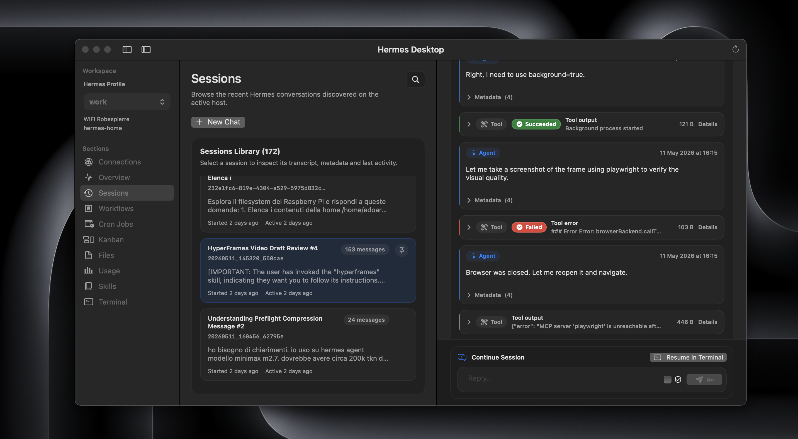
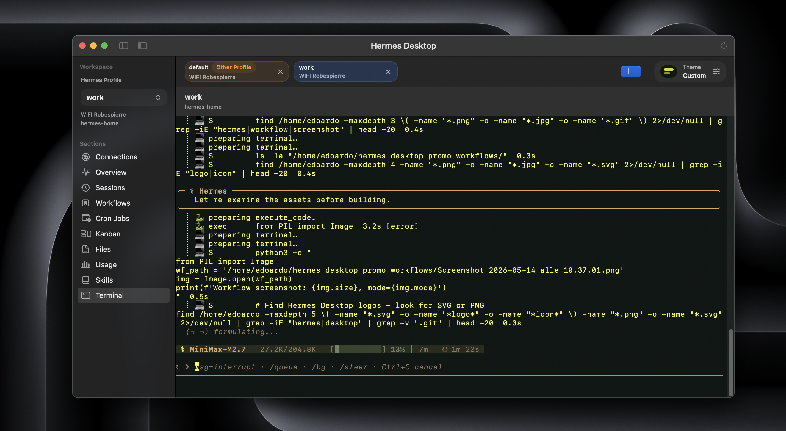
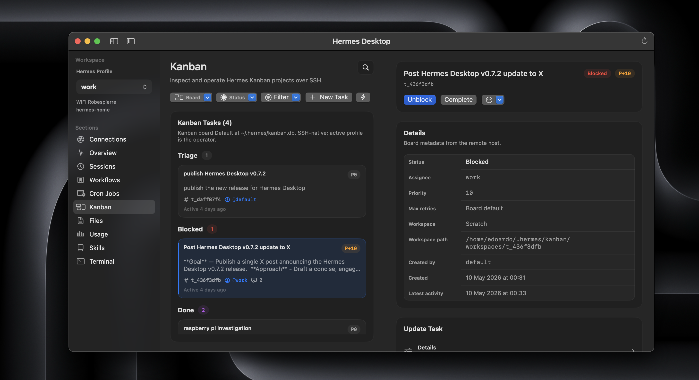
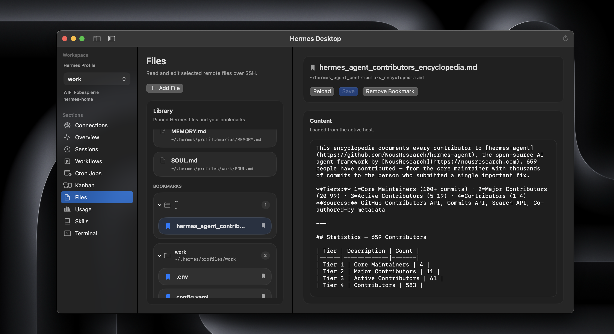

# Hermes Desktop

Native macOS companion for Hermes Agent over SSH.

It turns the daily Hermes loop into something you can actually live in on a
Mac: sessions, workflows, Kanban, workspace files, usage, skills, cron jobs,
and a real terminal in one focused window.

If Hermes is already part of how you work, the app should feel immediately
legible. Same host. Same files. Same profiles. Same source of truth.

No browser wrapper. No gateway API. No daemon on the host. No local mirror. No
extra sync layer slowly drifting away from the machine that actually matters.

That restraint is the point of the app.

Hermes Desktop does not invent a softer second version of Hermes. It gives the
real SSH-first workflow a calm, fast, native Mac surface while keeping the model
visible. You always know which host you are on, which Hermes profile is active,
which path the app is using, and where the work is happening.

## Preview

<table>
  <tr>
    <td width="50%">
      
    </td>
    <td width="50%">
      
    </td>
  </tr>
  <tr>
    <td width="50%">
      
    </td>
    <td width="50%">
      
    </td>
  </tr>
  <tr>
    <td width="50%">
      
    </td>
    <td width="50%">
      
    </td>
  </tr>
  <tr>
    <td width="50%">
      
    </td>
    <td width="50%">
      
    </td>
  </tr>
</table>

Eight previewed views from the app: sessions, terminal, Kanban, files,
skills, cron jobs, usage, and settings.

## What Hermes Desktop gives you

Hermes Desktop is for people who want a native Mac workbench for the Hermes
host they already use, without adding another layer to trust.

- connects directly over SSH
- keeps the Hermes host as the only source of truth
- works with multiple Hermes profiles for a multi-agent workflow
- reads the real remote sessions, Kanban, cron jobs, skills, files, and usage
- saves reusable workflow presets locally on your Mac, then launches them
  against the selected host/profile in a fresh Terminal tab
- includes an embedded SSH terminal for the moments where the shell is still
  the right tool
- ships as a universal macOS app for Apple Silicon and Intel Macs
- includes English, Simplified Chinese, and Russian localization resources

If Hermes runs there and SSH already works, Hermes Desktop will usually meet
you there. That includes a Raspberry Pi, another Mac, a VPS, a remote server,
or the same Mac through `ssh localhost` or a local SSH alias.

## How the app is designed

The app talks to the selected host over SSH. Sessions come from the remote
session store. Kanban comes from the upstream Hermes Kanban home. Cron jobs
come from the remote scheduler state. Files and skills are edited on the host
with conflict checks before save.

That restraint has a practical advantage: Hermes Desktop can remain useful when
higher-level surfaces are unavailable. If a dashboard, gateway, or agent
configuration breaks, the app still has the direct SSH path: inspect the host,
edit the relevant files, open a terminal, and repair the system from the place
where the state actually lives.

### Desktop and web dashboard

Hermes also has an official web dashboard. The two tools are complementary.

Use the dashboard when you want a browser-based management surface for the
installation: configuration, API keys, logs, sessions, analytics, cron jobs,
skills, and web chat.

Use Hermes Desktop when you want to work close to the host from your Mac:
sessions, workflows, Kanban, remote files, editable skills, usage, cron jobs,
and a real terminal without adding another backend around Hermes.

The boundary is simple: browser for administration, Mac app for direct host
work.

## Before you install

Setup is intentionally lightweight. Before you install, make sure you have:

- a Mac running macOS 14 or newer
- SSH access from this Mac to the Hermes host
- the SSH host key already accepted once in Terminal
- authentication that works without interactive prompts
- a normal network route to the host, such as LAN, DNS, public IP, VPN, or
  Tailscale
- `python3` available on the Hermes host
- Hermes data under the remote user's `~/.hermes`

For Sessions Chat, Terminal resume, and workflow launch, the remote `hermes`
CLI also needs to be available on the host's non-interactive SSH `PATH`.

For the native Kanban workspace, the host needs a Hermes Agent build with
upstream Kanban support. Newer Kanban features appear automatically when the
host exposes them.

Simple rule: if this works in Terminal from this Mac without asking for a
password or host key confirmation, the app is usually ready too:

```bash
ssh your-host
```

## Install the app

1. Download `HermesDesktop.app.zip` from the
   [latest GitHub Release](https://github.com/dodo-reach/hermes-desktop/releases/latest).
2. Double click the zip to extract `HermesDesktop.app`.
3. Quit Hermes Desktop if an older version is already running.
4. Drag `HermesDesktop.app` into `Applications` and replace the old copy if
   macOS asks.
5. First launch: right click `HermesDesktop.app`, choose `Open`, then confirm
   `Open`.

Hermes Desktop is currently ad-hoc signed and not notarized by Apple. macOS may
show a first-launch warning saying Apple cannot verify it for malware. That is
expected for this distribution model and does not mean macOS found malware in
Hermes Desktop.

If macOS blocks the first launch:

1. Click `Done`, not `Move to Bin`.
2. Right click `HermesDesktop.app` and choose `Open`.
3. If needed, go to `System Settings` > `Privacy & Security` and click
   `Open Anyway`.

Do not disable Gatekeeper or run `sudo` commands to install Hermes Desktop.

For the exact distribution and verification details, read
[docs/distribution.md](docs/distribution.md). If you prefer not to trust the
release zip, build from source instead.

## Connect a host

Open the app, go to `Connections`, create a profile, then click `Test` and
`Use Host`.

You can connect with an SSH alias or with host details directly.

### Use an SSH alias

An SSH alias is the cleanest path for most people. It is the short name you
already use in Terminal:

```bash
ssh hermes-home
```

That name usually comes from `~/.ssh/config`:

```sshconfig
Host hermes-home
  HostName vps.example.com
  User alex
```

In the app:

- set `SSH alias` to `hermes-home`
- leave `Host`, `User`, and `Port` empty unless you want explicit overrides

### Use host details

If you normally connect with:

```bash
ssh alex@vps.example.com
```

then in the app:

- `Host or IP`: `vps.example.com`
- `User`: `alex`
- `Port`: `22` or your real SSH port

### Choose a Hermes profile

Hermes Desktop can target multiple profiles on the same SSH host.

- leave `Hermes profile` empty to use `~/.hermes`; the app still discovers
  other profiles available on the active host
- set `Hermes profile` to `researcher` to use
  `~/.hermes/profiles/researcher`

The profile is not just a label. It flows through the app: Sessions, Workflows,
Cron Jobs, Kanban, Files, Usage, Skills, and Terminal all stay aligned with
the selected host and profile.

### Connect to the same Mac

If Hermes runs on the same Mac, the model stays the same: SSH.

Use `localhost`, your local hostname, or a local SSH alias. Hermes Desktop
still connects over SSH and does not read those files directly from disk.

### What `Test` checks

`Test` is a preflight. It checks that the SSH target is reachable,
authentication works without interactive prompts, and `python3` is available in
the remote SSH environment used by the app.

Feature-specific requirements, such as the remote `hermes` CLI path and Kanban
support, are checked when those sections actually run.

## What you can do in the app

Hermes Desktop is intentionally focused. It is not trying to become a cloud
workspace, a remote IDE, or a generic SFTP client.

It gives the real Hermes workflow a native workbench:

- `Sessions`
  Searches and reads the remote session store, including transcript content.
  You can pin important sessions, resume a session in the embedded TUI chat
  or in Terminal, and keep the session history close while you work.
- `Workflows`
  Saves reusable prompt presets on your Mac, scoped to the active host/profile,
  with optional skill selections. Running one opens a fresh Terminal tab and
  seeds the first Hermes turn without adding any remote shadow state.
- `Kanban`
  Opens the upstream Hermes Kanban workspace from the host. Board management,
  task editing, triage flows, comments, dependencies, run history, and recovery
  actions appear when the host supports them.
- `Files`
  Edits canonical Hermes files and selected remote text files with conflict
  checks before save.
- `Cron Jobs`
  Browses and manages the real Hermes scheduler state on the host, including
  create, edit, pause, resume, run-now, and delete actions.
- `Usage`
  Shows token totals, top sessions, top models, recent trends, and profile
  breakdowns when available.
- `Skills`
  Discovers remote `SKILL.md` files, reads skill metadata, and lets you create
  or edit skills anchored to the Hermes skills store.
- `Terminal`
  Opens a real SSH shell inside the app, with tabs, theme presets, font
  controls, background-image transparency, and enough room for multi-profile,
  multi-agent work.

## Which chat surface to use

Hermes Desktop does not replace the terminal surfaces Hermes already gives you.
It lets you choose the right one for the job.

- Use `Chat` in `Sessions` when you want the real Hermes TUI embedded in the
  app, already scoped to the selected SSH host and Hermes profile. The Chat
  view is a hosted `hermes --tui` session — there is no separate Desktop
  conversation layer in front of it.
- Use `Transcript` in `Sessions` when you want to inspect persisted history from
  the host without starting or resuming a live TUI.
- Use the embedded `Terminal` for heavier work where you want shell control,
  command approvals, long-running output, or manual review close at hand.
- Use `hermes --tui` in any terminal when you want the same Hermes TUI outside
  the desktop layout.

All of these paths still run Hermes on the selected host. The choice is about
surface area, not about creating a second source of truth.

## Trust and verification

If you are evaluating whether to trust Hermes Desktop, start here:

- read [SECURITY.md](SECURITY.md) for the current security model: what runs
  locally, what runs remotely over SSH, what the app stores, and which network
  calls it makes
- read [docs/distribution.md](docs/distribution.md) for the release model,
  including the limits of ad-hoc signing and what published checksums can and
  cannot prove
- build the app from source with `./scripts/build-macos-app.sh` if you prefer
  the clearest trust path available in this repo today

Current public releases include a SHA-256 checksum and a small JSON manifest
for `HermesDesktop.app.zip`.

After downloading:

```bash
shasum -a 256 HermesDesktop.app.zip
```

After installing:

```bash
codesign --verify --deep --strict /Applications/HermesDesktop.app
```

To verify a release zip against the published manifest from a repo checkout:

```bash
./scripts/verify-release.sh \
  /path/to/HermesDesktop.app.zip \
  /path/to/HermesDesktop.app.zip.manifest.json
```

Checksums are a useful integrity check, not a trust model. They tell you
whether your download matches the published release asset. They do not replace
source review, local builds, or understanding the current distribution model.

## Build locally

For cautious users, building from source is the clearest trust path available
in this repo today. For local development, it is also the supported path for
producing the app bundle directly:

```bash
./scripts/build-macos-app.sh
```

Then open:

```bash
dist/HermesDesktop.app
```

To run the release-support test suite:

```bash
./scripts/run-tests.sh
```

To create the GitHub Releases archive:

```bash
./scripts/package-github-release.sh
```

For release-candidate packaging, you can stamp an explicit version:

```bash
HERMES_VERSION=1.2.3 ./scripts/package-github-release.sh
```

Release artifacts:

- `dist/HermesDesktop.app.zip`
- `dist/HermesDesktop.app.zip.sha256`
- `dist/HermesDesktop.app.zip.manifest.json`

## FAQ

### Is it safe to install?

That is the right question, and you should not rely on reassurance alone.

Hermes Desktop is open source, uses direct SSH to the host you choose, does not
require a gateway API or helper service, and stores only a small amount of local
app state on your Mac. The built-in update check calls GitHub Releases for the
latest Hermes Desktop app version only; it does not update Hermes Agent and
does not send your host, profile, file, session, or Kanban content.

The current public build is ad-hoc signed and not notarized by Apple, so
macOS may show a first-launch warning. Cautious users should read
[SECURITY.md](SECURITY.md), read [docs/distribution.md](docs/distribution.md),
and consider building from source.

### Where does state live?

On the Hermes host.

Sessions, Kanban, cron jobs, files, skills, and usage are read from the
selected host and profile. Hermes Desktop does not maintain a local mirror of
Hermes state.

Some local app preferences and connection details are stored under
`~/Library/Application Support/HermesDesktop`. That includes connection
profiles, pinned sessions, bookmarked files, workflow presets, sidebar order,
and appearance preferences such as terminal font/theme and optional background
image assets. The current local state is documented in [SECURITY.md](SECURITY.md).

### Why do I still need SSH working in Terminal first?

Because the app uses the same SSH path your Mac already uses, but in a
non-interactive way.

If Terminal still needs password entry, host key confirmation, or other
interactive setup for that target, the app will usually hit the same wall.

### What does Sessions Chat do?

It runs the real Hermes TUI on the selected host over SSH, hosted inside the
`Sessions` view of the app.

Starting a new chat launches `hermes --tui` in an embedded TUI terminal.
Resuming a session launches `hermes --tui --resume <session-id>`, with the
selected Hermes profile preserved when one is active.

The important detail is that Chat is a hosted `hermes --tui` surface, not a
separate Desktop conversation backend. Sessions still reads persisted
transcripts back from the host, and the host remains the source of truth.

### Does Hermes Desktop replace a remote file manager or IDE?

No.

It lets you browse remote directories and bookmark selected text files next to
the canonical Hermes files. It is still a focused Hermes workspace, not a full
SFTP client or remote IDE. Remote text files up to 10 MB are editable.

### What happens if a remote file changed after I opened it?

Hermes Desktop will not blindly overwrite it.

Before saving an edited workspace file or skill, the app checks whether the
remote file still matches the version you opened. If it changed, save is
blocked and your local edits stay intact until you reload intentionally.

## Where Hermes Desktop goes next

Most of the original roadmap is now shipped.

Hermes Desktop has reached the shape it was aiming for: a calm, capable native
macOS workspace for the real Hermes workflow, still anchored to SSH and the
host as source of truth.

From here, the work is not about adding novelty for its own sake. It is about:

- polishing onboarding, diagnostics, Files ergonomics, terminal UX, and
  multi-host details
- tracking upstream Hermes Agent changes so the app stays close to the real
  host workflow
- keeping the trust story and release documentation aligned with the code and
  actual distribution model

Anything larger than that should be justified by Hermes itself, not added just
because it is technically possible.

## Merged projects

### HFConsole → Fleet tab (2026-06-12)

The Fleet dashboard originally lived in a standalone app
(`~/workspace/HFConsole`, now deprecated). Its workshop overview,
DAG pipeline viewer, task dispatch, and API client have been merged
into Hermes Desktop's Fleet tab. The model layer (`FleetModels.swift`)
now supports both HF and drama pipelines with full parity.

